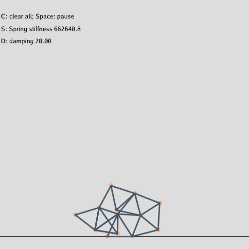

# Mass Spring 2D

Simple mass-spring system built by Taichi.

Besides the original explicit integration method, I added methods Runge-Kutta, Verlet and Implicit Integration.

Attention: Although Implicit Integration is unconditionally stable, the solver I implemented is just Gaussian Seidel, which can't get converge result at some extreme situation.

## Runge-Kutta

I used 4-order Runge Kutta methods. The intuitive idea behind Runge Kutta integration is sampling $f'$ (force in our application) multiple times in a single time step, get multiple approximate value of $f$ and finally weighted average them. 

For 4-order Runge Kutta, I first sample$f(x_0,v_0), x_0=x^t,$ $v_0=v^t$ , so $v_0'=f(x^t,v^t)/m$, approximate result $\hat{x}_0=x^t+x_0'\Delta t, \hat{v}_0=v^t+v_0'\Delta t$,

Then sample $x_1=x^t+0.5v_0\Delta t,$ $v_1=v^t+0.5v_0' \Delta t $ , so $v_1'=f(x_1,v_1)/m $, get the approximate result $\hat{x}_1,\hat{v}_1$ as above.

Then sample $x_2=x^t+0.5v_1\Delta t ,v_2=v^t+0.5v_1' \Delta t $ , so $v_2'=f(x_2,v_2)/m$,  get the approximate result $\hat{x}_2,\hat{v}_2$as  above.

Then sample $x_3=x^t+v_2\Delta t,v_3=v^t+v_2' \Delta t $ , so $v_3'=f(x_3,v_3')/m$, get the approximate result as $\hat{x}_3,\hat{v}_3$ above.

The final result $x^{t+1}=x^{t}+\frac{\Delta t}{6}(\hat{x}_0+2\hat{x}_1+2\hat{x}_2+\hat{x}_3), v^{t+1}=v^{t}+\frac{\Delta t}{6}(\hat{v}_0+2\hat{v}_1+2\hat{v}_2+\hat{v}_3)$

I implemented a func named by "Runge_KuttaIter", which calculate current approximate result and next sample points.

## Verlet

Taylor expansion of the positions in the two time directions yields:

$x(t+\Delta t)=x(t)+v(t)\Delta t+\frac{1}{2}a(t)\Delta t^2+...\\x(t-\Delta t)=x(t)-v(t)\Delta t+\frac{1}{2}a(t)\Delta t^2+...$

Adding equations above and rearrange terms gives:

$x(t+\Delta t)=x(t)+[x(t)-x(t-\Delta t)]+a\Delta t^2+...$

By this scheme,  we have to store the previous location $x$, and the velocity does not show up explicity. 

We bring the velocity back in by defining $v(t)=[x(t)-x(t-\Delta t)]/\Delta t$,

so the final formula is
$x^{t+1}=x^t+v^t\Delta t +f(x^t)\Delta t^2/m\\v^{t+1}=(x^{t+1}-x^t)/\Delta t $

I implemented a func named by "Verlet".

## Implicit

We rearrange the implicit formula by multiple mass

$Mv^{t+1}=Mv^t+\Delta t f(x^{t+1})$

$x^{t+1}=x+\Delta v^{t+1}$

In the source code, I implemented Newton-Raphson solver, I first linearizing the $f(x^{t+1})$ at $x^t$ (by taylor expansion)yields:

$Mv^{t+1}=Mv^{t}+\Delta t[f(x^t)+\frac{\part}{\part x}f(x^t)\cdot (\Delta t v^{t+1})]$

We use symbol $K$ as Jacobian of $f$, so $K=\frac{\part}{\part x}f(x^t)$, after rearranging, we can get expression like $Ax=b$:

$[M-\Delta t^2 K]v^{t+1}=Mv^t+\Delta tf(x^t)$

